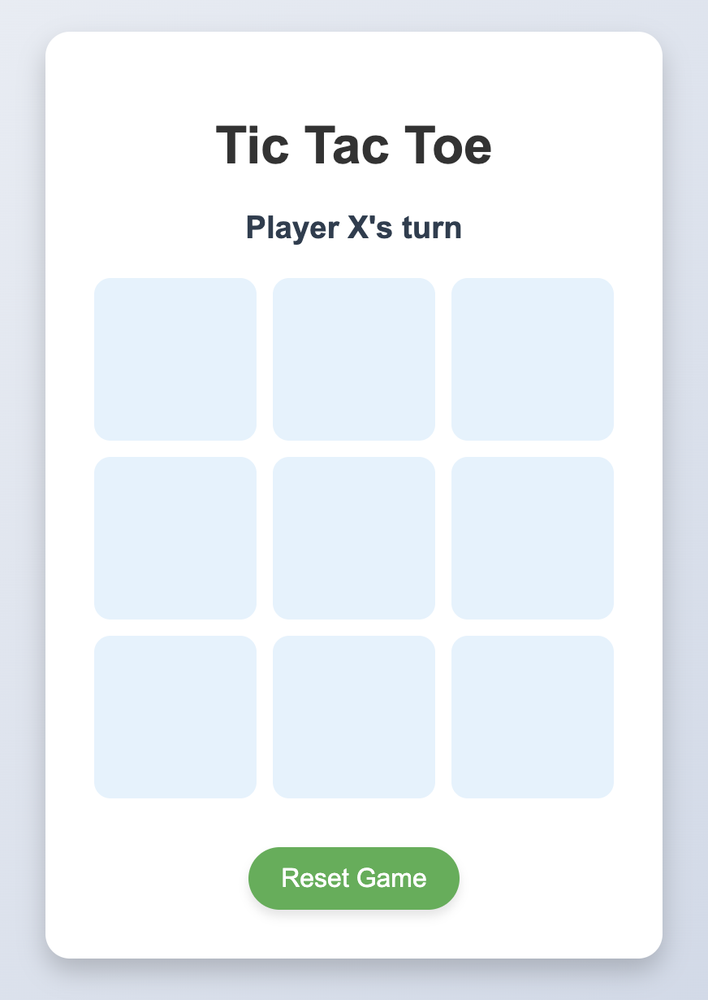

# Tic Tac Toe Game 🎮

A simple Tic Tac Toe game built using **HTML, CSS, and JavaScript**. Play against a friend by taking turns and enjoy a clean, responsive interface.

## ✨ Features

- 🧠 Follows standard Tic Tac Toe rules (X and O alternate)
- 🔁 **Reset Game** button to restart the game anytime
- 📱 Responsive design for mobile and desktop
- 💡 Easy-to-understand and lightweight codebase

## 🚀 How to Play

1. Open the game in your browser.
2. Click on any empty square to make a move.
3. Alternate turns between Player X and Player O.
4. The first to align 3 marks (horizontally, vertically, or diagonally) wins!

## 📷 Screenshot



> *(Add a screenshot to your repo and update the image name if needed)*

## 🛠 Tech Stack

- HTML5
- CSS3
- JavaScript (Vanilla)

## 🖥 Live Demo

🔗 [Play Now](https://yourusername.github.io/your-repo-name/)

## 📂 Project Structure
```
/tic-tac-toe/
├── index.html
├── style.css
└── app.js
```
created by **Atul Mishra**
